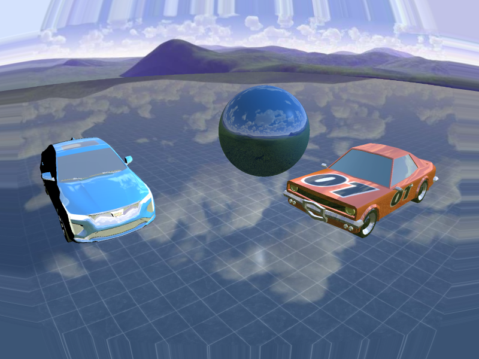
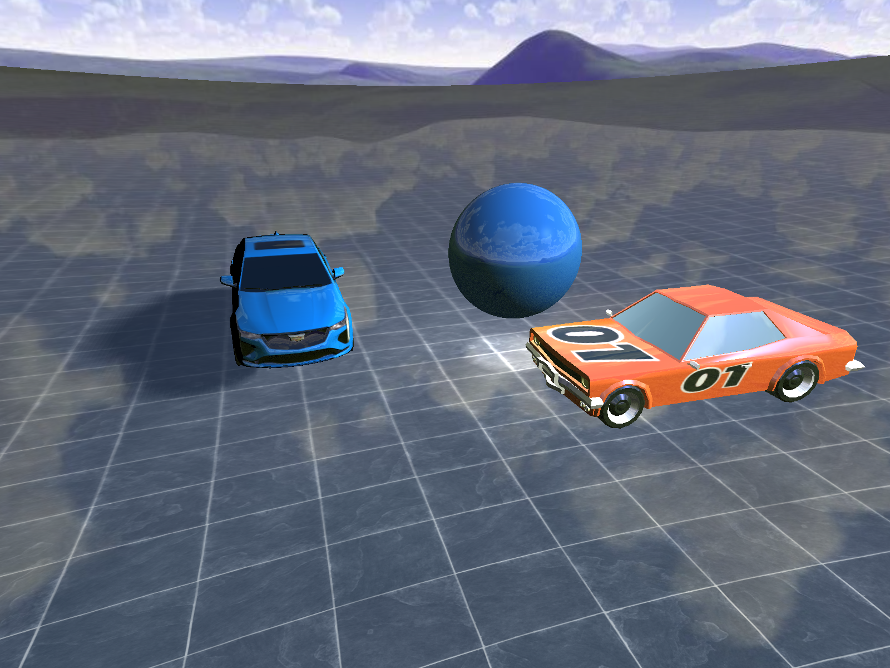

# Implementation of lens distortion simulation in OpenGL

This repository is still in development. The project can be used, but some features are still being implemented.

## Introduction
This project is an implementation of lens distortion simulation in OpenGL.
The goal is to simulate the distortion that occurs when rendering an image through a lens.

The distortion can be caused by radial and tangential distortion.
Radial distortion is caused by the lens not being perfectly spherical.
Tangential distortion is caused by the lens not being perfectly parallel to the image plane.

### 2 approaches are proposed to simulate the distortion:
- The first approach is to apply the distortion to the texture.
- The second approach is to apply the distortion to the vertices of the models.

In the file HeaderFile/GameState.h, you can change the approach by changing the value of the variable "gameState".

## First Approach
The scene is rendered to a custom framebuffer.
The image rendered in the framebuffer is then used as a texture to a quad.
The texture to the quad is then distorted using a lens distortion shader.

#### Radial distortion is model using the following equation:
```math
r = sqrt(x^2 + y^2) \\
```
```math
x' = x * (1 + k1 * r^2 + k2 * r^4 + k3 * r^6) \\
```
```math
y' = y * (1 + k1 * r^2 + k2 * r^4 + k3 * r^6) \\
```

Where k1, k2 and k3 are the radial distortion coefficients.

##### Tengential distortion is model using the following equation:
```math
x' = x + (2 * p1 * x * y + p2 * (r^2 + 2 * x^2)) \\
```
```math
y' = y + (p1 * (r^2 + 2 * y^2) + 2 * p2 * x * y) \\
```
Where p1 and p2 are the tangential distortion coefficients.

#### Pros and Cons
##### Pros
- Easy to implement
- Fast to compute
- Doesn't depend on the scene

##### Cons
- Since the distortion is applied to the texture, it leave unfilled areas in the corners of the image.

### Results
The following image is a demo of the lens distortion simulation using the first approach.



---

## Second approach (Work in progress)
Instead of applying the distortion to the texture, the position of each vertex can be moved to simulate the distortion.

To compute the new position of each vertex, we need to apply transformation to get to the clipping coordinates,
typically done using the projection-view-model (MVP) matrix.

```math
    \begin{bmatrix}
        x_{clip} \\
        y_{clip} \\
        z_{clip} \\
        w_{clip}
    \end{bmatrix}
    = MVP \times
    \begin{bmatrix}
        x_{model} \\
        y_{model} \\
        z_{model} \\
        1
    \end{bmatrix}
```
```math
    MVP = P \times V \times M
```
Where P is the projection matrix, V is the view matrix and M is the model matrix.

We then perform division by w to get the normalized device coordinates (NDC).

```math
    \begin{bmatrix}
        x_{ndc} \\
        y_{ndc} \\
        z_{ndc} \\
        1
    \end{bmatrix}
    = 
    \begin{bmatrix}
        x_{clip} \\
        y_{clip} \\
        z_{clip} \\
        w_{clip}
    \end{bmatrix}
    / w_{clip}
```


Then we can apply the distortion to the normalized coordinates using the following equation:

Radial distortion:
```math
    r = sqrt(x_{ndc}^2 + y_{ndc}^2) \\
```math
    x_{distorted} = x_{ndc} * (1 + k1 * r^2 + k2 * r^4 + k3 * r^6) \\
```
```math
    y_{distorted} = y_{ndc} * (1 + k1 * r^2 + k2 * r^4 + k3 * r^6) \\
```

Tangential distortion:
```math
    x_{distorted} = x_{ndc} + (2 * p1 * x_{ndc} * y_{ndc} + p2 * (r^2 + 2 * x_{ndc}^2)) \\
```
```math
    y_{distorted} = y_{ndc} + (p1 * (r^2 + 2 * y_{ndc}^2) + 2 * p2 * x_{ndc} * y_{ndc}) \\
```


Where k1, k2 and k3 are the radial distortion coefficients and r is the distance from the center of the image to the vertex position.

Once the distortion is applied, we can multiply the distorted coordinates by w to get the clip coordinates.

```math
    \begin{bmatrix}
        x_{clip} \\
        y_{clip} \\
        z_{clip} \\
        w_{clip}
    \end{bmatrix}
    =
    \begin{bmatrix}
        x_{distorted} \\
        y_{distorted} \\
        z_{distorted} \\
        1
    \end{bmatrix}
    \times w_{clip}
```

Finally, we can multiply the clip coordinates by the inverse of the MVP matrix to get the model coordinates.

```math
    \begin{bmatrix}
        x_{model} \\
        y_{model} \\
        z_{model} \\
        1
    \end{bmatrix}
    =
    MVP^{-1} \times
    \begin{bmatrix}
        x_{clip} \\
        y_{clip} \\
        z_{clip} \\
        w_{clip}
    \end{bmatrix}
```
#### Results
The following image is a demo of the lens distortion simulation using the second approach.



#### Pros and Cons
##### Pros
- Should resolve the unfilled areas in the corners of the image.
- To be determined ...

##### Cons
- Dependent on the polygon resolution of each models present in the scene.
- To be determined ...

To solve the dependency on the polygon resolution, we can use a geometry shader to increase the number of vertices of each polygon.
That way we don't need to load high-resolution models at the start of the application.

#### Note
This approach need further investigation to check its validity. And find its pros and cons.

---
### Dependencies
- OpenGL
- GLFW
- GLEW
- GLM
- stb_image
- Assimp

You can install the dependencies using setup.bash script.