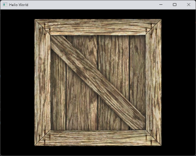

# Implementation of lens distortion simulation in OpenGL (STILL IN DEVELOPMENT)

This repository is still in development. The code is not yet ready for use.

This is a simple implementation of lens distortion simulation in OpenGL. 
It uses a simple vertex and fragment shader to simulate the lens distortion effect.
The radial and tangential distortion are computed in the fragment shader.

## Demo
 

## Dependencies
- OpenGL
- GLFW
- GLEW
- GLM
- stb_image
