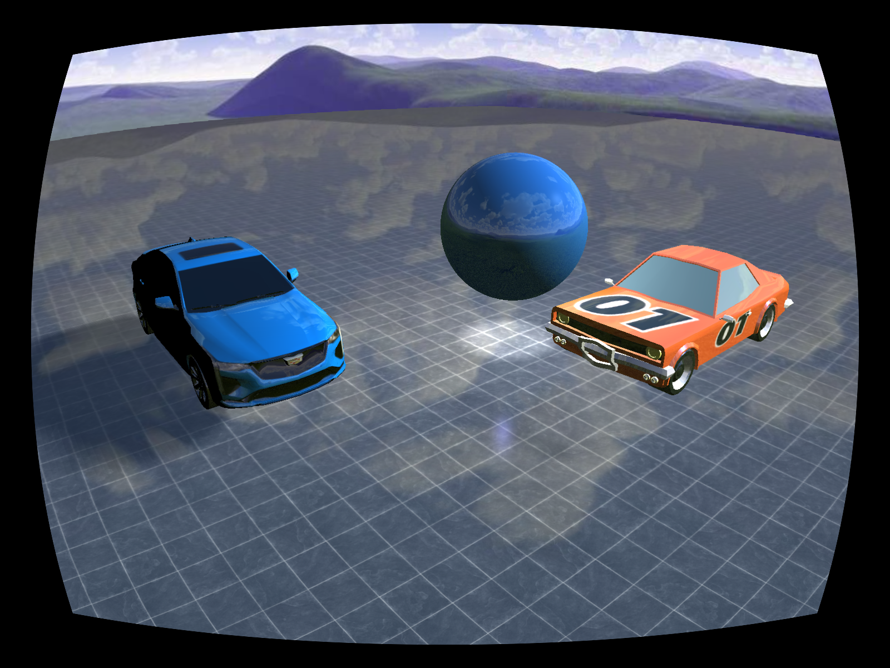

# Implementation of lens distortion simulation in OpenGL

This repository is still in development. The project can be used, but some features are still being implemented.

## Approach
The scene is rendered to a custom framebuffer.
The image rendered in the framebuffer is then used as a texture to a quad.
The texture to the quad is then distorted using a lens distortion shader.

#### Radial distortion is model using the following equation:
```math
r = sqrt(x^2 + y^2) \\
```
```math
x' = x * (1 + k1 * r^2 + k2 * r^4 + k3 * r^6) \\
```
```math
y' = y * (1 + k1 * r^2 + k2 * r^4 + k3 * r^6) \\
```

Where k1, k2 and k3 are the radial distortion coefficients.

#### Tengential distortion is model using the following equation:
```math
x' = x + (2 * p1 * x * y + p2 * (r^2 + 2 * x^2)) \\
```
```math
y' = y + (p1 * (r^2 + 2 * y^2) + 2 * p2 * x * y) \\
```
Where p1 and p2 are the tangential distortion coefficients.

### Pros and Cons
#### Pros
- Easy to implement
- Fast to compute
- Doesn't depend on the scene

#### Cons
- Since the distortion is applied to the texture, it leave unfilled areas in the corners of the image.

## Demo
The following image is a demo of the lens distortion simulation.




## Dependencies
- OpenGL
- GLFW
- GLEW
- GLM
- stb_image
- Assimp

 You can install the dependencies using setup.bash script.

---

## Different approach (Not implemented yet)
Instead of applying the distortion to the texture, the position of each vertex can be moved to simulate the distortion.

The compute the new position of each vertex, we need to apply transformation to get to the clipping coordinates,
typically done using the projection-view-model (MVP) matrix.

```math
    \begin{bmatrix}
        x_{clip} \\
        y_{clip} \\
        z_{clip} \\
        w_{clip}
    \end{bmatrix}
    = MVP \times
    \begin{bmatrix}
        x_{model} \\
        y_{model} \\
        z_{model} \\
        1
    \end{bmatrix}
```
```math
    MVP = P \times V \times M
```
Where P is the projection matrix, V is the view matrix and M is the model matrix.

We then perform division by w to get the normalized device coordinates (NDC).

```math
    \begin{bmatrix}
        x_{ndc} \\
        y_{ndc} \\
        z_{ndc} \\
        1
    \end{bmatrix}
    = 
    \begin{bmatrix}
        x_{clip} \\
        y_{clip} \\
        z_{clip} \\
        w_{clip}
    \end{bmatrix}
    / w_{clip}
```


Then we can apply the distortion to the normalized coordinates using the following equation:

```math
    x_{distorted} = x_{ndc} * (1 + k1 * r^2 + k2 * r^4 + k3 * r^6) \\
```
```math
    y_{distorted} = y_{ndc} * (1 + k1 * r^2 + k2 * r^4 + k3 * r^6) \\
```

Where k1, k2 and k3 are the radial distortion coefficients and r is the distance from the center of the image to the vertex position.

Once the distortion is applied, we can multiply the distorted coordinates by w to get the clip coordinates.

```math
    \begin{bmatrix}
        x_{clip} \\
        y_{clip} \\
        z_{clip} \\
        w_{clip}
    \end{bmatrix}
    =
    \begin{bmatrix}
        x_{distorted} \\
        y_{distorted} \\
        z_{distorted} \\
        1
    \end{bmatrix}
    \times w_{clip}
```

Finally, we can multiply the clip coordinates by the inverse of the MVP matrix to get the model coordinates.

```math
    \begin{bmatrix}
        x_{model} \\
        y_{model} \\
        z_{model} \\
        1
    \end{bmatrix}
    =
    MVP^{-1} \times
    \begin{bmatrix}
        x_{clip} \\
        y_{clip} \\
        z_{clip} \\
        w_{clip}
    \end{bmatrix}
```

### Pros and Cons
#### Pros
- Should resolve the unfilled areas in the corners of the image.
- To be determined ...

#### Cons
- Might be dependent on the polygon resolution of each models present in the scene.
- To be determined ...

### Note
This approach need further investigation to check its validity. And find its pros and cons.